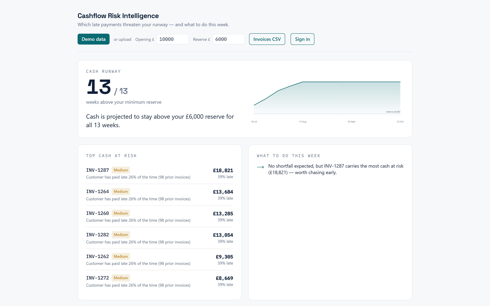

# Cashflow Risk Intelligence

[](https://github.com/rosscyking1115/cashflow-risk/actions/workflows/ci.yml)
[](https://www.python.org/downloads/release/python-3120/)
[](https://mypy-lang.org/)
[](https://github.com/astral-sh/ruff)
[](LICENSE)

Which of a small business's unpaid invoices could break its cash runway, when the
shortfall lands, and which ones to chase this week. Give it a CSV of invoices and
it forecasts a 13-week runway, ranks the invoices by expected cash at risk
(late-payment risk score × amount outstanding), folds Companies House filings
into each customer's score, and writes a short action brief. Every score comes
with the reason behind it. The score orders the chase list; it is a ranking
score, not a calibrated probability, and the repo measures how far off it is.

> Part of my responsible-fintech cluster, alongside
> [responsible-neobank-growth](https://github.com/rosscyking1115/responsible-neobank-growth)
> and
> [cited-market-brief-agent](https://github.com/rosscyking1115/cited-market-brief-agent).
> Full project map → [profile](https://github.com/rosscyking1115).

> [!IMPORTANT]
> **Synthetic data only, and nothing here is advice.** This is a reference
> project, not a commercial product. It is not for sale, holds no real customer
> data, and every figure in it — the demo, the forecasts, the risk scores, the
> evaluation — comes from a seeded generator. Its output is decision support, not
> accounting, tax, legal, credit or investment advice, and not a recommendation
> about any company. [docs/CREDIBILITY.md](docs/CREDIBILITY.md) states exactly
> what the numbers may and may not be read as.

**[▶ Live demo](https://cashflow-web-sidu.onrender.com/)** — opens on a synthetic
dataset, no sign-in.

> [!NOTE]
> The demo is hosted on a free tier, which sleeps when idle and is sometimes
> unavailable altogether. A first load taking around 30 seconds is the host
> waking up, not a fault. If the dashboard reports that the service could not be
> reached, it is the hosting rather than the project — everything the demo shows
> can be reproduced locally with the commands under
> [Getting started](#getting-started), and the evaluation behind it is in
> [docs/MODEL_CARD.md](docs/MODEL_CARD.md).
> [ADR 0003](docs/adr/0003-hosted-demo-backend-stays-down.md) records why the
> hosted backend is left as it is rather than patched around.



<p align="center"><em>The dashboard on synthetic demo data: runway forecast, cash-at-risk ranking, and the weekly action.</em></p>

## What it does

- Forecasts 13 weeks of cash from an invoice ledger, timing each invoice by when
  it is likely to be paid rather than when it is due.
- Ranks invoices and customers by expected cash at risk, so a large invoice from a
  mostly-reliable customer can outrank a small one from a bad payer.
- Writes an action brief: the chase list for the week and what it does to the
  runway.
- Reads a customer's Companies House record (overdue accounts, insolvency,
  charges) into their late-payment score, refreshed by a daily job.
- Separates tenants. Owners and invited accountants get different roles, every
  query is scoped to a business, and a cross-tenant read is refused.

## How it works

```
 Next.js dashboard ──TLS + JWT──> FastAPI engine ──> PostgreSQL (system of record)
   (Clerk sign-in)                    │
                                      ├──> Companies House Public Data API (read)
                                      └──> Sentry (errors, PII-scrubbed)
```

The engine is plain Python: a leakage-safe feature store, forecast baselines and a
rules-based scorer, put behind FastAPI. PostgreSQL is the only system of record,
and it holds derived results only. Uploads are parsed and discarded. The
risk-model bake-off (rules, logistic regression, gradient boosting) runs at
training time, is tracked in MLflow, and never ships in the runtime image.

Stack: Python 3.12, FastAPI, SQLAlchemy, Alembic, PostgreSQL, scikit-learn,
Next.js, React, Tailwind, Clerk, Sentry, Render, GitHub Actions.

## Fully typed, and the type check can fail the build

The engine runs under **`mypy --strict`** — `strict = true` in
[`pyproject.toml`](pyproject.toml), not a handful of strict-ish flags — across the
whole `cashflow_risk` package, 44 source files, no `ignore_errors` and no
per-module opt-outs beyond four `ignore_missing_imports` entries for third-party
libraries that ship no stubs.

It is a gate, not a habit. CI runs `uv run mypy` as its own step on every push and
every pull request, with no `continue-on-error`, so a type error fails the build
and the branch does not merge. Same for `ruff check` and the test suite. Run it
yourself:

```bash
uv run mypy        # Success: no issues found in 44 source files
```

Scope worth knowing: the check covers the published package. `tests/` and
`scripts/` are outside it.

## Model evaluation

On the synthetic data **neither fitted rung beats its rules counterpart**, and the
evaluation says why. A health oracle, read straight from the generator's latent
truth, clears prevalence by only 0.100 mean PR-AUC lift, so the ceiling is low to
begin with. Most of what is left is a macro factor you cannot see at issue time
without leaking the answer.

Models are scored on a rolling-origin, group-aware backtest that is **purged by
the label horizon** — a training invoice is dropped unless its outcome had already
resolved when the test window opened. That purge is not decoration. The folds were
originally split on issue date alone, so 69.7% of training rows carried an outcome
from inside the test period, and every fitted model's edge turned out to be that
overlap:

- **Gradient boosting** fell from +0.036 to **−0.004** — below prevalence, so it
  ranks worse than the base rate.
- **The pre-declared gate margin** — the best fitted rung minus *its own* rules
  counterpart (logistic+CH against rules+CH), required to be ≥ +0.10 — is now
  **−0.012**. Negative: the best fitted rung is worse than the baseline it had to
  beat. Like-for-like on matched windows it moved +0.003 → −0.012; the +0.020 this
  project used to publish came from the older all-four-unpurged-folds protocol, so
  the two are not a before-and-after pair.
- **The rules scorer moved +0.000.** It never reads its training set, so purging
  cannot move it. That zero is what makes the other differences attributable to
  the leak rather than to folds being reshuffled.

The scores are also **not calibrated** — mean ECE 0.186, or 0.212 once Companies
House signals are in, over-predicting lateness by 17–20 percentage points — so
they rank the chase list and nothing more.
[docs/MODEL_CARD.md](docs/MODEL_CARD.md) is the one-page version;
[docs/model-evaluation.md](docs/model-evaluation.md) has the workings and both
arms side by side.

That is the honest result and it is the reason to look at this repo rather than a
reason not to: the evaluation was capable of detecting that its own models had no
edge, and it did. The purge, the matched-window comparison and the rules control
are the machinery that made a negative result findable instead of comfortable.

## Security and privacy

An invoice ledger is commercially sensitive, and where the customers are sole
traders it is personal data too. Several of the controls are enforced by tests
rather than documented and hoped for:

- Every query is scoped to a tenant, and a test asserts that one tenant cannot
  read another's run even with a guessed id.
- Raw uploads are never stored. Only derived results are.
- Sentry runs with no PII, no local variables and no request bodies, plus
  `before_send` redaction. A test uploads marker values and checks that none of
  them reach the logs.
- Exports escape cells starting with `=`, `+`, `-` or `@`, so a spreadsheet cannot
  execute them. Uploads have size and row limits and are content-sniffed rather
  than trusted by MIME type. There is an append-only audit log, self-serve export
  and delete, and a 24-month retention purge.

The reasoning is written down: a [STRIDE threat model](docs/threat-model.md) and a
[security policy](SECURITY.md), plus a [DPIA](docs/dpia.md) and a
[privacy notice](docs/privacy-notice.md) — both drafted to the point where the
bracketed fields need a real legal entity, and both labelled as drafts, because
processing synthetic data does not trigger either one.

## Getting started

You need [uv](https://docs.astral.sh/uv/) (Python 3.12) and Node.js 20+.

Run the engine and print an action brief for a synthetic business:

```bash
uv sync                          # create the venv + install deps
uv run pytest                    # run the test suite
uv run python scripts/demo.py    # print an action brief for a synthetic SME
```

Reproduce the model evaluation:

```bash
uv run python scripts/eval_risk_baseline.py   # rules-baseline metrics
uv run python scripts/bakeoff_risk.py         # rules vs logistic vs GBM, backtested
```

Run the dashboard, which needs two processes:

```bash
# 1. API. CASHFLOW_ENV=dev enables a local token so uploads work without a
#    hosted login; omit it and only the public demo is available.
CASHFLOW_ENV=dev uv run uvicorn cashflow_risk.api:app --port 8000

# 2. Web dashboard (another terminal); npm install only the first time.
cd web && npm install && npm run dev   # http://localhost:3000
```

It opens on the public demo. **Invoices CSV** analyses your own export; the tenant
comes from the token, never from client input.

> [!NOTE]
> The synthetic data is the only data. Every number in this repository comes from
> a seeded generator, so the engineering claims hold as written while the
> magnitudes are illustrative and nothing here is evidence of predictive skill on
> a real ledger. [docs/CREDIBILITY.md](docs/CREDIBILITY.md) sorts every figure
> into what it can and cannot support.

## Configuration

Configuration comes from the environment. The defaults are safe, so it runs
locally with none of it set. Copy [`.env.example`](.env.example) to `.env` to
change anything.

| Variable | Purpose |
|---|---|
| `DATABASE_URL` | Postgres connection string (defaults to a local SQLite file) |
| `CASHFLOW_JWT_SECRET` | Signing secret; **required** in production |
| `CASHFLOW_ENV` | `dev` enables the local dev-token endpoint |
| `CLERK_JWKS_URL`, `CLERK_ISSUER` | Enable Clerk-verified sign-in on the API |
| `COMPANIES_HOUSE_API_KEY` | Enables customer risk enrichment |
| `SENTRY_DSN` | Enables PII-scrubbed error reporting (optional) |
| `CASHFLOW_RETENTION_DAYS` | Auto-purge window for results (default 730) |
| `NEXT_PUBLIC_API_BASE` | Points the web app at a non-default API |

## Database and migrations

Local dev creates the SQLite tables on startup. Managed databases use Alembic, and
the API runs `alembic upgrade head` when it deploys:

```bash
uv run alembic upgrade head                              # apply migrations
uv run alembic revision --autogenerate -m "describe it"  # after a model change
```

## Testing and CI

```bash
uv run pytest          # tests
uv run ruff check .    # lint
uv run mypy            # type-check (strict)
```

Every push and pull request runs those, plus a check that the migrations apply to
an empty database and still match the models (`alembic upgrade head` and
`alembic check`), plus the Next.js production build. See
[.github/workflows/ci.yml](.github/workflows/ci.yml).

## Deployment

The API, dashboard, managed Postgres and a daily maintenance cron deploy to Render
from [`render.yaml`](render.yaml) as a blueprint, which is how the
[live demo](https://cashflow-web-sidu.onrender.com/) is hosted. Steps in
[docs/deployment.md](docs/deployment.md).

## Project layout

| Path | What |
|---|---|
| `src/cashflow_risk/` | The engine: `domain`, `datagen`, `features`, `forecasting`, `risk`, `reporting`, `ingestion`, `enrichment`, `db`, `auth`, `api` |
| `web/` | Next.js dashboard |
| `scripts/` | `demo.py`, the model evaluation and risk bake-off, and the daily maintenance job |
| `alembic/` | Database migrations |
| `docs/` | Architecture, and the security and privacy docs |

## Data sources and licence

The code is MIT ([LICENSE](LICENSE)). The only external data source is the
**Companies House Public Data API**, read live and never redistributed here.
Companies House data is published under the
[Open Government Licence v3.0](https://www.nationalarchives.gov.uk/doc/open-government-licence/version/3/);
anything derived from it in this project carries that licence and this
attribution: *Contains public sector information licensed under the Open
Government Licence v3.0.* Every other figure in the repository is generated, not
sourced.

## Documentation

- [docs/MODEL_CARD.md](docs/MODEL_CARD.md) — what the model is, what it scored, and what it may not be used for
- [docs/CREDIBILITY.md](docs/CREDIBILITY.md) — what each number may and may not be read as
- [docs/model-evaluation.md](docs/model-evaluation.md) — how the risk model is measured, and what it scored
- [docs/architecture.md](docs/architecture.md) — architecture and its trade-offs
- [CONTEXT.md](CONTEXT.md) — the domain model and ubiquitous language
- [SECURITY.md](SECURITY.md) — security posture and vulnerability reporting
- [docs/threat-model.md](docs/threat-model.md) — STRIDE threat model
- [docs/security_privacy.md](docs/security_privacy.md) · [docs/dpia.md](docs/dpia.md) · [docs/privacy-notice.md](docs/privacy-notice.md)
